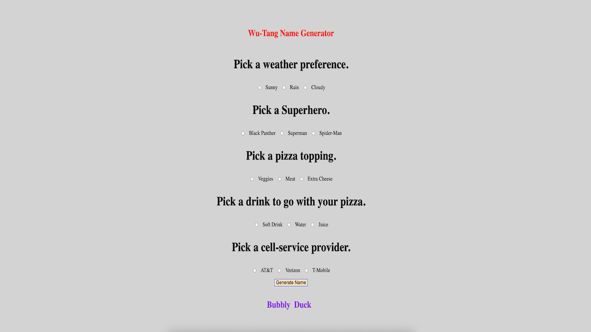

# 🎤 Wu-Tang Name Generator

**Wu-Tang Name Generator** is a fun web application that takes a user’s input and returns a unique, randomly-generated Wu-Tang Clan-style name.

---

## 🧠 About The Project

Wu-Tang Name Generator playfully transforms a user’s name into a rapper-style alias reminiscent of the iconic hip-hop group but with a twist. This app brings nostalgia and humor with every click.

### 🛠️ Built With

- **HTML** – Structure of the page  
- **CSS** – Styling and layout  
- **JavaScript** – Name logic and DOM manipulation  

---

## 📸 Screenshot

---

## 📄 License

Distributed under the MIT License. See `LICENSE` for more information.

---

## 📬 Contact

**Azeez Olaosebikan**  
[GitHub](https://github.com/ozazeez)  
[LinkedIn](https://www.linkedin.com/in/azeezolaosebikan)
